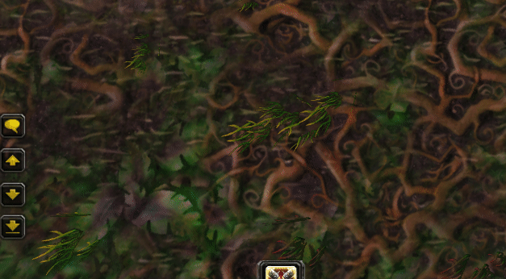

# ShaguJunk

This addon can automatically delete and vendor specified items. It comes with two lists.
A vendor-list that automatically sells all items on it to a merchant and a delete-list that
automatically deletes the specified items whenever a new item is pushed into the inventory.

The lists can by displayed by typing `/junk ls`. You can add new entries to the list by either
typing `/junk delete ITEMNAME` for the delete list or `/junk vendor ITEMNAME` for the vendor list.
There is also `/junk dungeon ITEMNAME` for items to delete while only inside of a dungeon, 
as well as `/junk temp ITEMNAME` for items to delete until new game session (or plugins are reloaded)

Instead of typing the item name, one can also use item links (shift-click the item).

You can also specify a limit for grey items in silver using `/junk grey SILVERVALUE`,
which will delete any item with stack value below this limit

Removing items from the list can be done via `/junk rm ID`, where ID is the identifier number
that is shown in `/junk ls`.

If the `/junk` command is already occupied by another addon, the `/sjunk` command can be used.

**WARNING: USE AT YOUR OWN RISK**

## Installation (Vanilla, 1.12)
1. Download **[Latest Version](https://github.com/shagu/ShaguJunk/archive/master.zip)**
2. Unpack the Zip file
3. Rename the folder "ShaguJunk-master" to "ShaguJunk"
4. Copy "ShaguJunk" into Wow-Directory\Interface\AddOns
5. Restart Wow

## Installation (The Burning Crusade, 2.4.3)
1. Download **[Latest Version](https://github.com/shagu/ShaguJunk/archive/master.zip)**
2. Unpack the Zip file
3. Rename the folder "ShaguJunk-master" to "ShaguJunk-tbc"
4. Copy "ShaguJunk-tbc" into Wow-Directory\Interface\AddOns
5. Restart Wow

## Commands

* **/junk**
* **/sjunk**
